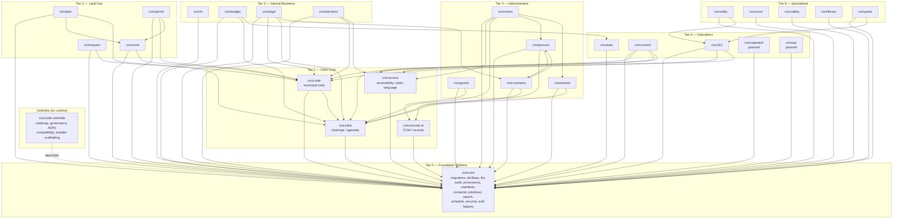

# CivicSuite Architecture

**Last verified:** 2026-07-02

This document is the suite-level architecture reference. For detailed per-module architecture, see each module's `docs/`. For the architectural intent and roadmap, see `docs/CivicSuiteUnifiedSpec.md`. For the current shipped reality, see [STATUS.md](STATUS.md).

---

## The single load-bearing rule

**Modules depend on `civiccore`. `civiccore` never depends on modules.**

This rule is non-negotiable. Every other architectural decision in CivicSuite serves it. Without it, modules become coupled, the suite becomes a monorepo by accident, and cities cannot deploy modules independently.

---

## Suite topology



Diagram-as-code: this Mermaid graph lives in version control and updates when the dependency rule does. Per-module pin versions are tracked in [docs/compatibility/index.md](docs/compatibility/index.md), not here.

---

## Standard stack

Every module inherits the same deliberately boring stack unless an ADR explicitly overrides it:

| Layer | Choice | Pin / Notes |
|---|---|---|
| Backend | FastAPI on Uvicorn | — |
| Database | PostgreSQL 17 + `pgvector` | Required for vector search |
| Cache / queue | Redis | Pinned `<8.0` (BSD); never SSPL releases |
| Workers | Celery + Celery Beat | — |
| LLM runtime | Ollama (local) | Default Gemma 4 family |
| Embeddings | `nomic-embed-text` | Local |
| Frontend | React behind nginx | — |
| Migrations | Alembic | CivicCore baseline first, then per-module |

The shipped Windows Local desktop profile overrides three of these rows per [ADR-0008](docs/architecture/ADR-0008-portable-native-windows-runtime.md) and [ADR-0009](docs/architecture/ADR-0009-postgres-backed-queue-windows-profile.md): cache/queue → the PostgreSQL-backed CivicCore task queue, workers → bundled CPython city services, frontend → the Tauri/WebView2 desktop shell (see "Windows Local desktop distribution" below).

This stack is local-first by design. No outbound calls in the default deployment profile. External LLM providers and external connectors are **opt-in adapters**, never default.

---

## Per-module architecture pattern

Every runtime module follows the CivicRecords AI template:

```
modulename/
  modulename/
    __init__.py
    main.py            # FastAPI app entrypoint
    routes/            # FastAPI routers
    models/            # SQLAlchemy models in modulename schema
    persistence.py     # Optional DB-backed persistence
    services/          # Domain logic
    prompts/           # YAML prompt library if AI-using
    public_ui.py       # Resident-facing surface
  alembic/
    versions/          # Per-module migrations after civiccore baseline
  tests/
  docs/
    index.html         # GitHub Pages landing
    UNIFIED-SPEC.md    # Module-specific spec
  scripts/
    verify-release.sh
    verify-docs.sh
  pyproject.toml       # Pins civiccore to a versioned release wheel
  README.md README.txt USER-MANUAL.md USER-MANUAL.txt
  CHANGELOG.md CONTRIBUTING.md SECURITY.md SUPPORT.md CODE_OF_CONDUCT.md
  LICENSE LICENSE-CODE
  .github/ISSUE_TEMPLATE/ .github/PULL_REQUEST_TEMPLATE.md
```

The repo skeleton is enforced by `scripts/verify-docs.sh` in the umbrella; module-specific verification lives in each module's own `verify-release.sh`.

---

## Data flow rules

### Within a module
- Per-module schema or clearly bounded table namespace (e.g., `civicclerk.meetings`, `civiczone.parcels`).
- Foreign keys into CivicCore shared tables (e.g., `civiccore.users`, `civiccore.audit_log`) where needed.
- Hash-chained audit logging via CivicCore primitives.

### Across modules
- Modules **may not** read each other's database directly. Cross-module reads go through internal HTTP APIs.
- The "internal API" between modules is governed by the unified spec §13–14 and the per-module specs.
- Examples:
  - `civicclerk` writes adopted ordinances → `civiccode` ingests via the CivicClerk handoff API.
  - `civiczone` reads code text from `civiccode` via the section resolution API.
  - `civicgrants` searches `civicrecords-ai` for grant context via records-ai's query API.

### Public-facing data
- Every module that has a public surface exposes it through its own `/<modulename>` route.
- A future shared resident portal shell aggregates these routes; it is **not** a replacement for module-owned public surfaces.
- `CivicAPI` (planned) will be the public read-only data gateway exposing only human-approved publication records, never staff-only or closed-session data.

---

## CivicCore extraction phasing

CivicCore is built incrementally. The extraction model is from the v0.1 spec (`specs/02_CivicCore.md`):

- **Phase 0** — repo skeletons and baseline LICENSE / CHANGELOG / CONTRIBUTING.
- **Phase 1** — User, Role, Department, audit_log models + Alembic baseline. Shipped at civiccore v0.1.0.
- **Phase 2** — LLM provider abstraction. Shipped at v0.2.0.
- **Phase 3** — Connectors, ingest contracts, search helpers, scheduling, security helpers. Shipped progressively v0.3.0–v0.22.x.
- **Phase 4** — Auth/RBAC extraction (in progress).
- **Phase 5** — Document storage, full search engine, exemption rules, sovereignty verification, scaffolding generators (planned).

Reserved namespaces (`civiccore.catalog`, `civiccore.exemptions`, `civiccore.scaffold`, full `civiccore.notifications` runtime, sovereignty verification) are placeholder packages. Downstream modules **must not depend on planned CivicCore behavior** unless that behavior is released in a versioned CivicCore artifact.

---

## Compatibility versioning

Modules pin to CivicCore as a released dependency. The exact form (example shown against an older CivicCore release) is:

```toml
[project]
dependencies = [
  "civiccore @ https://github.com/townlight/core/releases/download/v1.0.1/civiccore-1.0.1-py3-none-any.whl#sha256=561d7a8f73260d50de79351d330876d2cb3488c0e046a2888e82fe09d1e03969",
  ...
]
```

The pin is to a published release wheel, not a Git SHA. This keeps installs reproducible and removes the need for `git` in the runtime image.

When CivicCore ships a backward-compatible change:
1. CivicCore releases the new version.
2. The compatibility matrix is updated.
3. Consumer modules adopt the new version using the standard rollout playbook in `docs/roadmap/shared-extraction-consumer-rollout.md`.
4. Compatibility matrix records the new pairing.

When CivicCore ships a breaking change:
1. The change is documented in advance via an ADR.
2. CivicCore releases first.
3. Consumers ship paired changes.
4. Compatibility matrix records the new pairing.

---

## Sovereignty boundaries

- **No telemetry.** No outbound runtime calls in the default profile.
- **No vendor cloud dependency.** External LLM providers (OpenAI, Anthropic) are optional adapters.
- **No per-seat metering.** Apache 2.0 + CC BY 4.0 licensing.
- **Air-gapped deployment** is a first-class operational mode, not a checkbox feature.
- **Operator owns data.** Connectors are read-first; write-back connectors only after audited read paths are stable.

These are architectural commitments, not aspirational marketing. The clean-machine, fully-local install path was verified end to end for the v1.0.2 MSI (Phase D); broader per-module verification continues.

---

## Suite installer architecture

The suite-level installer (in beta — the Docker-based multi-module path, separate from the shipped Windows Local MSI described below) is module-aware and CivicCore-first:

1. Detect host OS and capacity.
2. Verify baseline dependencies (Docker, WSL on Windows, etc.).
3. Install CivicCore matching the selected modules' compatibility pins.
4. Present a menu-style module selector driven by `installer/modules.json`.
5. Install selected modules in dependency order.
6. Run health checks and record a proof bundle.

See [installer/README.md](installer/README.md) for the contract and [docs/installer/suite-installer-plan.md](docs/installer/suite-installer-plan.md) for the plan.

### Windows Local desktop distribution

Separate from the Docker-based installer above, the shipped Windows artifact is a single MSI (CivicSuite Windows Local, currently v1.0.2) built around a Tauri/WebView2 desktop shell. It bundles its full runtime rather than assuming host dependencies:

- **PostgreSQL 17 + `pgvector`** as portable binaries, with the Microsoft VC++ runtime DLLs (`vcruntime140.dll`, `vcruntime140_1.dll`, `msvcp140.dll`) staged into `postgres\bin` so the database starts on a factory-fresh Windows machine with no system VC++ redistributable installed.
- **Embedded CPython** running the module services.
- **Bundled Ollama** on `127.0.0.1:15434` serving the pinned `gemma-4-12b-it-qat-q4_0` model; the suite's shared local-generation helper calls it via `/api/chat`. The model itself (~7 GB) is downloaded and SHA-256-verified on first run, with a pre-staged path for air-gapped installs.

One MSI installs the six-module city-core profile: CivicCore, CivicRecords AI, CivicClerk, CivicCode, CivicNotice, and CivicAccess. Module source is pinned by `source_commit` in [installer/modules.json](installer/modules.json); see [PROVENANCE.md](PROVENANCE.md) for how the bundled commits relate to each module's published releases.

---

## Anti-patterns

These are explicitly out of scope for the suite:

- **Monorepo.** CivicSuite is a multi-repo product family. Each module ships independently.
- **System-of-record replacements.** Not first-wave ERP, utility billing, permitting, CAD/RMS, or courts.
- **Cloud-only.** Cloud is not a deployment mode CivicSuite optimizes for.
- **Per-seat pricing.** The license forecloses this option.
- **Vendor write-back without audit.** All write-back connectors must wait until read paths are stable and auditable.
- **Auto-determination.** No auto-release, auto-denial, auto-redaction, auto-enforcement, or auto-codification. AI drafts; humans decide.

These are documented at length in `specs/01_catalog.md` §16–20 and `docs/CivicSuiteUnifiedSpec.md` §3.

---

## Diagrams to add

Known gaps / planned diagrams:

- A request-lifecycle sequence diagram for `civicrecords-ai` (received → assigned → in-review → released).
- An agenda-and-meeting lifecycle sequence diagram for `civicclerk` (DRAFTED → SUBMITTED → ON_AGENDA → IN_PACKET → POSTED → HEARD → DISPOSED).
- A connector data-flow diagram showing import / normalization / persistence / audit boundaries.
- An audit-chain diagram showing how hash-chained audit primitives flow across module boundaries.

These should land in `docs/architecture/` as Mermaid `.md` files when the underlying flows stabilize.
